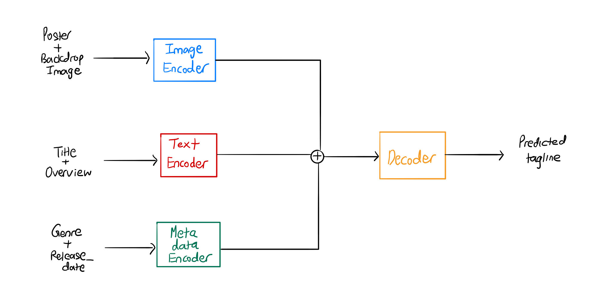

# CE1115 DSAI Project 
> Data Science Project to build a movie tagline predictor. 

## Project motivation and utility

Ever found yourself staring at a certain movie tagline and wondering what on earth the directors were thinking about when they came up with it? Yes, we too. On the other hand, we've also often been on the other end of the spectrum, struggling to come up with creative titles for our projects or succinct one-liners to encapsulate our business pitches. Enter our movie tagline predictor, a model we have built which we hope will provide some enlightenment to the many lost souls described above. We believe that this model can be transferrable to other salient applications, such as the web-link summarization we often see accompanying our everyday Google searches. 

## Installation

### Package install:
Run the following command to install the package from PyPI or conda.

`pip install DSAI_proj`

`conda install DSAI_proj`

### Editable Install:
1) Clone the repository locally and cd into it. 

2) Create a virtual/conda/pipenv environment first.

3) Depending on which type of environment you are using, run one of the following commands:

`pip install -e`

`conda develop .`

`pipenv install -e`

## Data Extraction

The main function in this package perform the following functions for data extraction via the TMDB API:
- Multi-threaded download of movie information via the extract_dataset_threaded function.
- Saving the data to a raw_data.csv file.

## Exploratory Data Analysis & Visualization

Now that we have our raw dataset to work with, we begin by looking at:
- The different types of data present.
- How they might be relevant to our task.
- Their respective distributions and whether there might be class imbalances.
- Missing data and other considerations to be had later during cleaning.

## Data Cleaning and Feature Engineering 

After the EDA step, we have generated insights from the data in terms of their distribution and relevance our overall task. The functions in this package we perform the following functions to clean and feature engineer the raw data:
- Drop columns which are irrelevant.
- For columns/features with json objects, unpack the json objects into new columns.
- For categorical features, ensure that they are categorized accordingly.
- For datetime features, ensure that they are separated out into year, month and day before either being rescaled or binned.
- Separate out examples with and without taglines.
- Save the dataset into separate train, valid, test and tagless csv files.

# Dataset

We next create the Dataset class to encapsulate all the different types of data which we will be working with. We also add in augmentations and transformations including:
- Tokenization of text based on the text based encoder which we will be using (DistilBert).
- RandomResizeCrop to resize all images to a standard size and crop them randomly.
- Normalization and Standardization of all images on the imagenet dataset statistics.
- Converting all features to Pytorch tensors. 

## Modelling

Moving on, we model the problem by creating the architectures and modules required to map the various inputs to the predicted tagline. In our case, we will be using an encoder-decoder based structure, with the encoder consisting of separate networks for image, text and meta/tabular data respectively, while the decoder consists of a few transformer decoder layers and a linear layer to output the predicted sequence. 

## Training and Evaluation

We leverage the famous FastAI library to help us with training. The library provides us with numerous benefits, including advanced training techniques using learning rate schedulers and discriminative learning rates, along with seamless integration of features such as mixed precision training in the case where our model might be too big for GPU memory.

We also run evaluation on our test set, as well as predict some examples from the tagless csv to see how our model might perform in real life.

## Results interpretation and recommendations

TO-DO!!!
